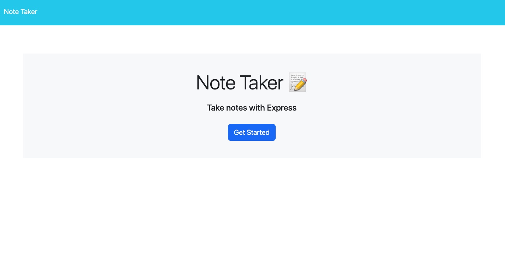
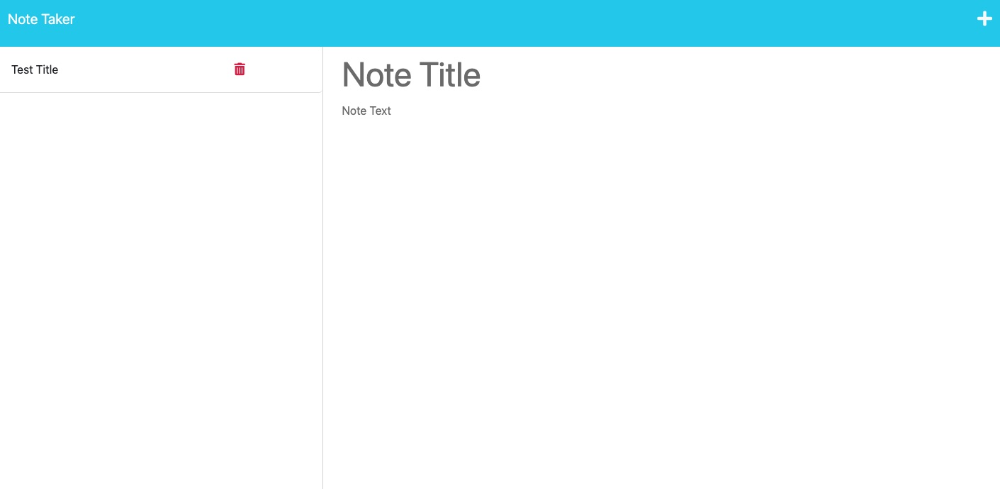
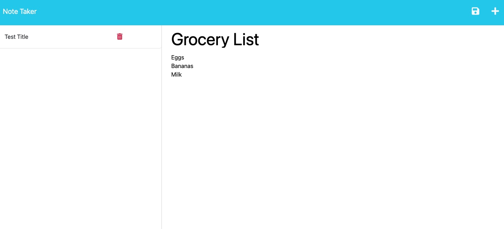
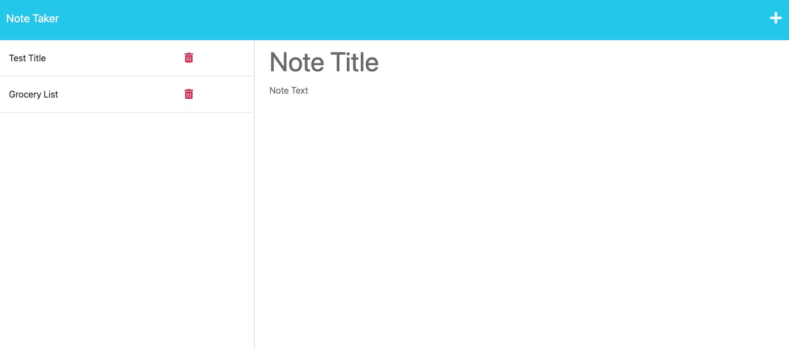

# Homework 11 - Note Taker

## Description

For this assignment, I was tasked taking existing code for a note-taking application and update its code to created a functioning application. While the front-end was created, it needed the creation of a back-end running Express.js to complete it's functionality. 

## Table of Contents

- [Installation](#installation)
- [Usage](#usage)
- [Contributing](#contributing)
- [Tests](#tests)
- [Questions](#questions)

## License

    This project has no license.

## Installation

No installation necessary when accessed via this deployed link: https://floating-atoll-65346.herokuapp.com/

## Usage

A user will be presented with start page containing a "Get Started" button. 

Once clicked, they will be taken to the note-taking appliation with a blank note. Once they enter a title and note content, a disk icon will appear and when clicked, the note will be saved to the left panel. 

To access a note, simply click on the note on the left and it will appear. When a note is completed or no longer needed, the red trash can icon can be clicked to remove it. 

## Contributing

Thank you to Bryan and Shawn for the starter code and their infinite patience through this process. Big thank you to my fellow students for the long study sessions. I used W3 schools to fill in the gaps.

## Tests

None. 

## Questions

My GitHub username is JasperJackalope and here is a link to the repository for this project: https://github.com/JasperJackalope/11-note-taker 

Link to the deployed application: https://floating-atoll-65346.herokuapp.com/
